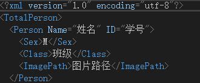
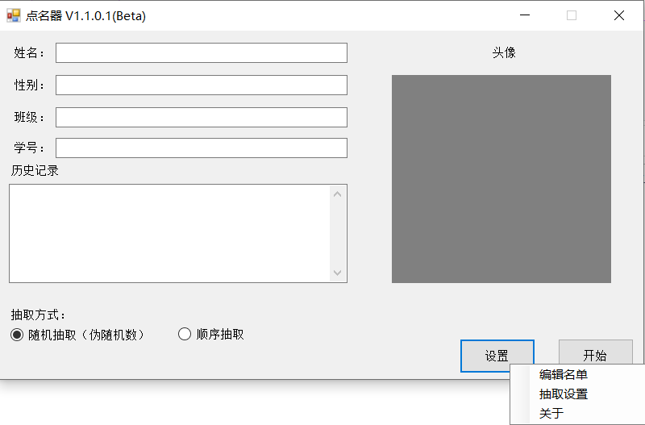
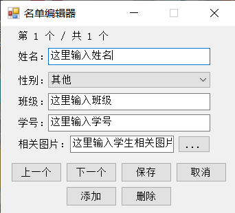
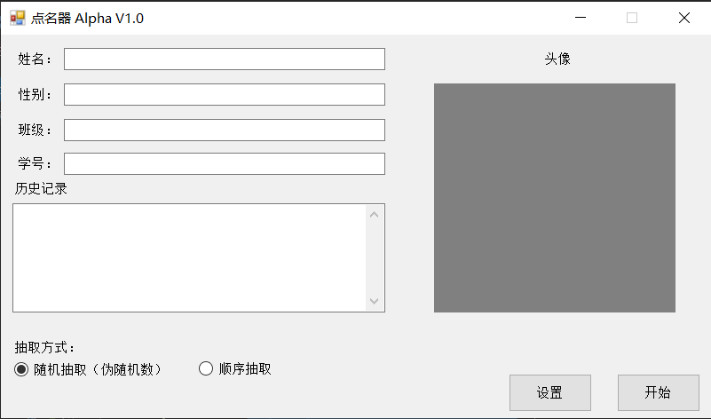
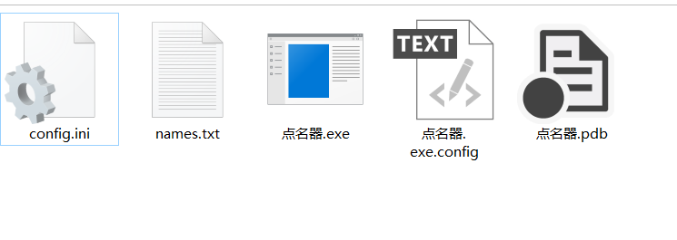
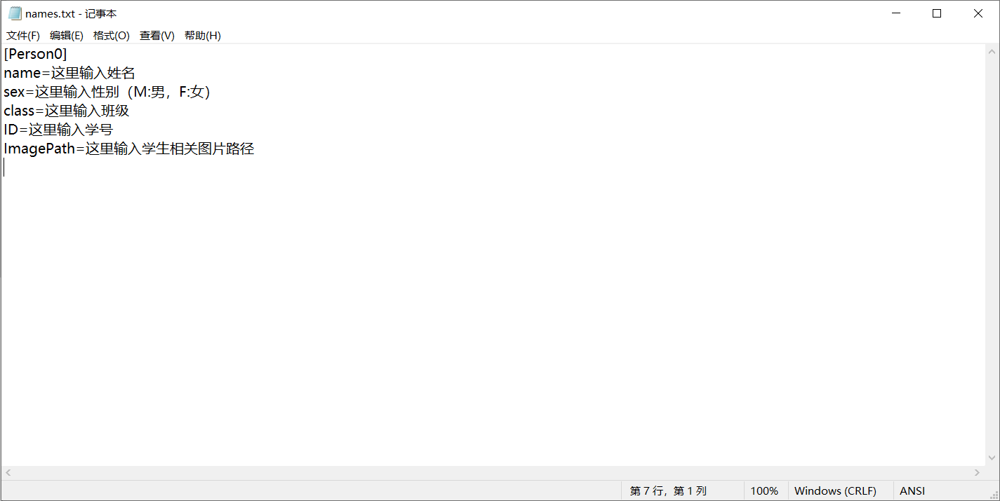
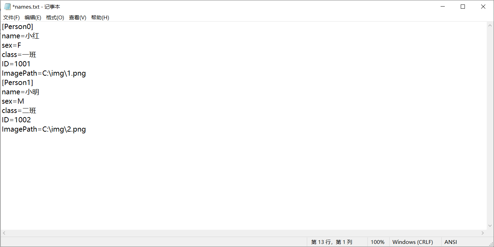
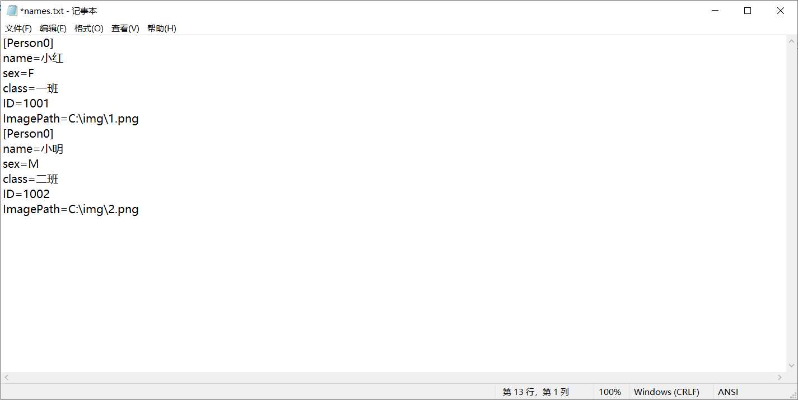

# 点名器 V1.1.1.0(Beta)重要通知：名单文件将更新为XML（测试）！！！
## 更新内容：
* 名单文件不再是names.txt，而是names.xml
* 名单格式：
* 
### 解释
* TotalPerson：总节点
* Person节点：保存了一些名单信息，其中Name属性为姓名，ID属性为学号
* Sex节点：性别
* Class节点：班级
* ImagePath节点：学生图片路径
* 其中Person Sex Class节点顺序不能更换！！！
* **同时：文件字符集将使用带BOM的UTF-8！！！**
# 点名器 Beta V1.1更新：
1. 新增了名单编辑模块，使名单编辑更加方便
2. 优化代码结构（字符串判断），增加异常处理，防止程序因异常而中断。
## 重点更新：
### 名单编辑系统
1. 首先，打开主程序，点击“设置”->“编辑名单”，如图：
* 
2. 然后可以看到下图窗口：
* 
* **对以下功能的解释：**
  - 上一个：上一个名单信息
  - 下一个：下一个名单信息
  - 保存：保存名单信息，保存后程序不会退出，也不需要重新启动程序
  - 取消：关闭当前窗口，信息不会被保存
  - 插入：在名单的末尾处插入名单信息
  - 删除：删除当前名单信息
* **同时，原编辑方式也得到保留，即打开names.txt文件并进行编辑。但请注意！！！使用此方式编辑需重启程序！！！**
# 点名器 Alpha V1.0.0.3 更新内容：
1. 更新了“历史记录”文本框的文本无法往下滑的问题。
2. 优化代码结构
# 点名器 Alpha V1.0.0.2 更新内容：
1. 修正了更改随机数种子导致无法随机抽取的问题。
2. 新增了在程序内启动修改名单的功能。
# 点名器 Alpha V1.0.0.1
此点名器本着友好的原则，而为老师或老板们开发的一个非常实用的工具。希望各位老师喜欢！
## 提示
1. 语音功能还在开发，因此此调试版无此功能
2. 名单文件的字符编码集请使用ANSI，请不要使用Unicode，否则会乱码
3. 完成名单编辑后，请重启程序（如果程序正在运行）
4. 若要运行此程序，请确保你的计算机已经安装.NET Framework 4.7.2，否则程序将无法运行
## 使用方法
1. 第一步 启动程序，之后可以看到一个页面。
* 
2. 之后可以看到此程序的目录出现了两个文件，分别是"config.ini"和"names.txt"，其中"config.ini"是配置文件，不能乱改，而"names.txt"为名单。
* 
3. 打开"names.txt"文件，可以看到以下内容：
* 
* 由于本名单为ini文件，所以需要遵守ini文件的语法
* 其中对一些值的介绍
  - name：为学生的姓名
  - sex：为学生的性别，M为男性，F为女性。如果输入其他除M和F的内容，软件会显示”其他“
  - class：为学生的班级
  - ID：为学生的学号
  - ImagePath：为学生相关图片，会作为头像显示。需要保证文件路径没有问题，否则图片无法显示
* 如果需要添加学生，则需要增加节点。如初始化文件的节点是Person0，则再写个Person1，如：
* 
* 其中Person0就是第一个学生，Person1则是第二个学生
* **注意**
* 节点可以填写其他的（名称随意），但不可以出现两个一样的。如:
* 
* 而以下是错误的：
* 
